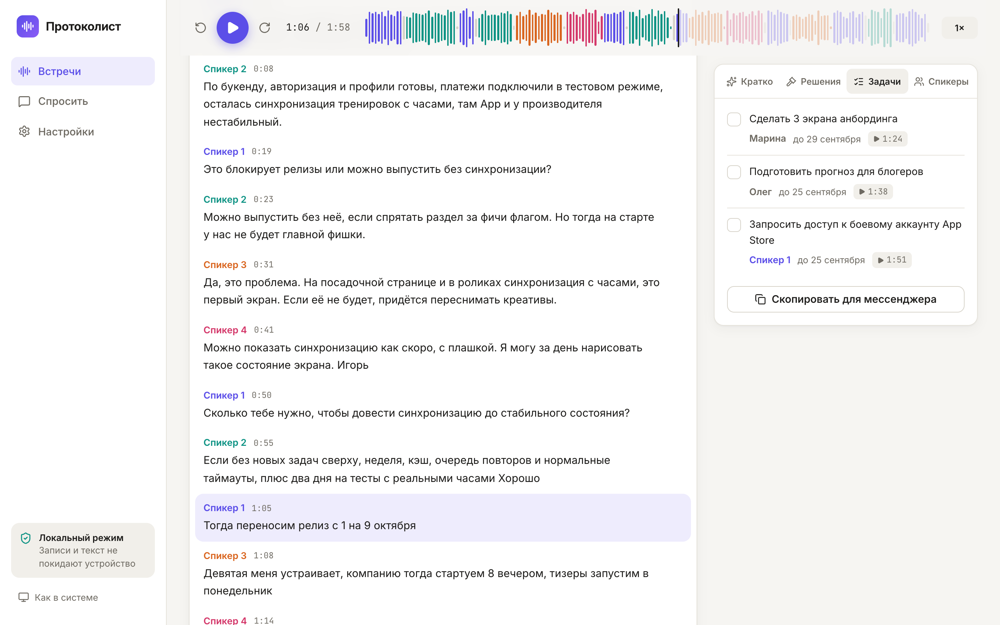
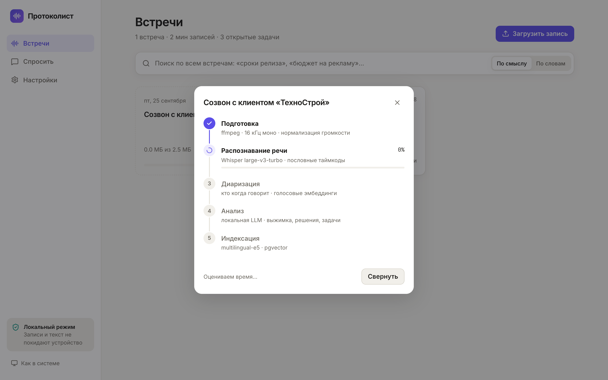
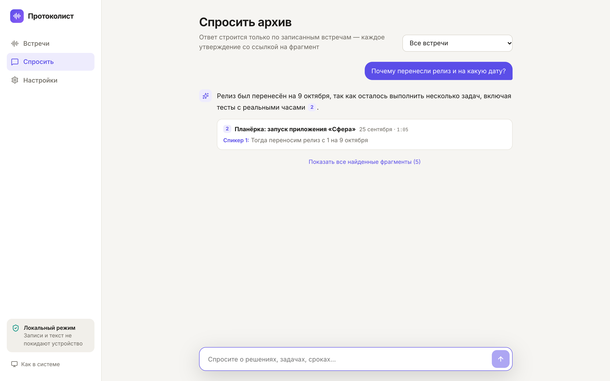
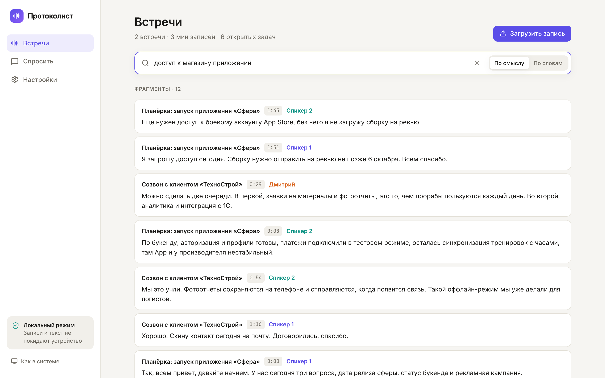
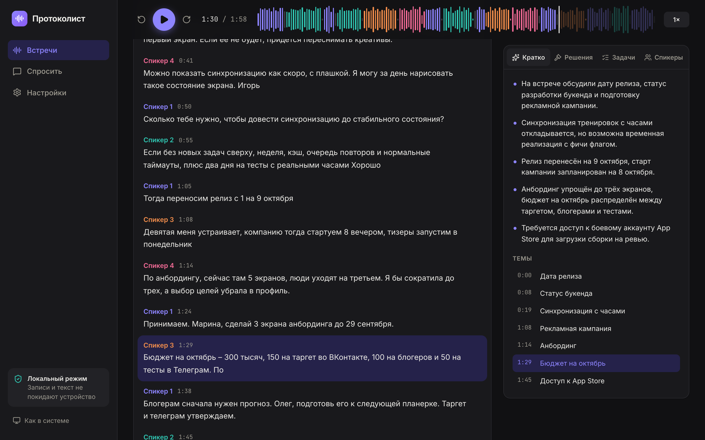

# Протоколист

Локальная расшифровка совещаний. Загружаете запись встречи — получаете текст по спикерам с таймкодами, краткое содержание, решения и задачи с ответственными и сроками. По всему архиву встреч работает смысловой поиск и чат с ответами со ссылками на фрагменты записи.

**Всё работает на своём компьютере или сервере**: записи и текст никуда не отправляются. Распознавание, разделение по спикерам, языковая модель и поиск — локальные.



## Что умеет

- **Загрузка** любых аудио и видео до 2 ГБ, частями, с продолжением после обрыва связи.
- **Обработка в фоне** с прогрессом по этапам в реальном времени (Server-Sent Events): подготовка → распознавание → диаризация → анализ → индексация.
- **Стенограмма**: реплики по спикерам, клик по фразе перематывает запись, текущая фраза подсвечивается. Режимы «чистый текст» (без слов-паразитов) и «дословно». Ручная правка реплик.
- **Спикеры**: доля времени каждого, переименование «Спикер 2 → Анна» по всей встрече. Имена, прозвучавшие в разговоре, подставляются сами — но только если это подтверждает стенограмма.
- **Анализ**: краткое содержание, решения, задачи (что / кто / до какого числа), темы с таймкодами. У каждого пункта — ссылка на момент записи.
- **Поиск по архиву** по смыслу («доступ к магазину приложений» находит реплику про аккаунт App Store) и по словам.
- **Вопросы к архиву**: ответ по записанным встречам со ссылками-цитатами; если ответа нет — так и говорит, а не выдумывает.
- **Экспорт**: DOCX-протокол, Markdown, субтитры SRT/VTT, JSON.
- Светлая и тёмная темы, работа с телефона.

| Загрузка и обработка | Вопросы к архиву |
|---|---|
|  |  |
| **Поиск по смыслу** | **Тёмная тема** |
|  |  |

## Как устроено

```
React (Vite, TS) ──HTTP/SSE──▶ FastAPI ──▶ Postgres 16 + pgvector
                                              ▲   (встречи, реплики, векторы, очередь задач)
                                              │
                         Worker ──────────────┘
                           ├─ ffmpeg: 16 кГц моно, нормализация громкости
                           ├─ Whisper large-v3-turbo (MLX на Apple Silicon, faster-whisper на Linux)
                           ├─ диаризация: pyannote community-1 или своя (WeSpeaker + кластеризация)
                           ├─ Qwen 3 8B через Ollama: выжимка, решения, задачи
                           └─ multilingual-e5-small: эмбеддинги реплик
```

Ключевые решения (подробно — в [ТЗ, раздел 9](docs/TZ.md#9-решения-принятые-по-ходу-работы)):

- **Очередь — таблица в Postgres** (`FOR UPDATE SKIP LOCKED`), без Redis. Каждый этап сохраняет результат в базу, поэтому после перезапуска обработка продолжается с того же этапа.
- **Своя диаризация**, когда закрытые модели pyannote недоступны: речь режется на фразы по паузам (по таймкодам слов и по энергии сигнала — Whisper растягивает слова на паузы), для каждой фразы считается эмбеддинг голоса WeSpeaker только по озвученным кадрам, длинные фразы кластеризуются, число спикеров подбирается по силуэту, короткие фразы наследуют спикера соседей, если голос не указывает однозначно на другого.
- **Имена спикеров**: языковая модель предлагает, код проверяет — обращение по имени в начале реплики и ответ следующей репликой, либо представление «меня зовут…».
- **Анализ в два прохода**: обзор всей встречи и поиск решений/задач окнами по 40 реплик — маленькой модели проще быть внимательной на коротком фрагменте, и длинные встречи не упираются в контекст.
- **Поиск**: косинусное сходство e5 плюс небольшой бонус за совпадение слов (полнотекстовый поиск Postgres); в RAG к каждой найденной реплике добавляются соседние.
- **Память**: перед распознаванием модели Ollama выгружаются — на 16 ГБ Whisper рядом с загруженной LLM работал в 10 раз медленнее.

## Качество — измерено

Все цифры получены скриптами из `bench/`, сырые результаты — в `bench/results/`. Железо: MacBook Pro M4, 16 ГБ.

**Распознавание речи** — Whisper на тестовых частях [Golos](https://huggingface.co/datasets/bond005/sberdevices_golos_100h_farfield) (SberDevices), по 200 фраз из каждой: farfield — дальний микрофон, как в переговорке; crowd — фразы, записанные людьми на свои устройства. WER — доля ошибок в словах (меньше — лучше), CER — в буквах. RTF — время обработки / длительность записи (0,1 = минута записи за 6 секунд).

| Модель | WER farfield | WER crowd | CER farfield | RTF farfield |
|---|---|---|---|---|
| tiny | 82,6 % | 81,9 % | 46,4 % | 0,049 |
| small | 37,1 % | 27,9 % | 13,5 % | 0,095 |
| medium | 26,1 % | 22,4 % | 9,7 % | 0,251 |
| **large-v3-turbo** | 19,5 % | 15,4 % | 6,3 % | 0,325 |
| large-v3 | 17,5 % | — | 6,7 % | 0,499 |

«—» — ещё не посчитано: `python bench/asr.py --models large-v3 --duty 0.5`.

По умолчанию стоит large-v3-turbo: на farfield WER 19,5 % против 17,5 % у large-v3, а работает в 1,5 раза быстрее.

RTF в таблице завышен для всех моделей: каждая фраза Golos длится 2–5 с, а Whisper обрабатывает окно в 30 с. На сплошной записи встречи turbo работает с RTF 0,15 (118 с записи за 17 с, вместе с загрузкой модели).

**Диаризация** — синтетическая встреча из 16 реплик 4 спикеров (118 с, `bench/make_synthetic.py`), встроенный алгоритм, DER с допуском 0,25 с на границах:

| Число спикеров | Найдено | DER | Из них путаница спикеров |
|---|---|---|---|
| определяется автоматически | 4 из 4 | 2,7 % | 0,1 % |
| задано пользователем | 4 из 4 | 2,7 % | 0,1 % |

WER всего пайплайна на этой записи — 6,3 %. Синтетика — один голос TTS с разным тоном: это проверка на регрессии, а не оценка на реальных встречах.

**Поиск** — 14 вопросов своими словами к той же встрече, у каждого известен правильный ответ (`bench/retrieval.py`). Recall@1 — правильная реплика на первом месте, Recall@3 — в первой тройке.

| Способ | Recall@1 | Recall@3 | MRR |
|---|---|---|---|
| Полнотекстовый, все слова запроса | 14,3 % | 14,3 % | 0,14 |
| Полнотекстовый, любое слово | 35,7 % | 64,3 % | 0,49 |
| Векторный, e5-small (8,1 мс/текст) | 78,6 % | 85,7 % | 0,85 |
| Векторный, e5-base (37,8 мс/текст) | 78,6 % | 85,7 % | 0,85 |
| Векторный, e5-large (116,4 мс/текст) | 78,6 % | 85,7 % | 0,85 |
| Векторный, USER-bge-m3 (123,4 мс/текст) | 64,3 % | 78,6 % | 0,76 |
| **Векторный e5-small + бонус за слова (в приложении)** | 78,6 % | 85,7 % | 0,85 |

Модели крупнее e5-small на этом наборе не выиграли, а работают в 5–15 раз медленнее, поэтому в приложении стоит e5-small. Набор маленький: вывод предварительный.

## Запуск

### macOS (Apple Silicon)

Нужны Docker, Python 3.13, Node 22, ffmpeg и [Ollama](https://ollama.com).

```bash
cp .env.example .env                      # впишите HF_TOKEN (см. ниже)
docker compose up -d db                   # Postgres + pgvector на :5433
cd backend
python3.13 -m venv .venv && .venv/bin/pip install -r requirements-mac.txt
.venv/bin/alembic upgrade head
.venv/bin/python -m app.download          # модели один раз, дальше работа без сети
ollama pull qwen3:8b
.venv/bin/uvicorn app.main:app --port 8010 &
.venv/bin/python -m app.worker &
cd ../web && npm ci && npm run dev        # http://localhost:5173
```

### Linux (всё в контейнерах, CPU)

```bash
cp .env.example .env
docker compose --profile full up -d --build
docker compose exec ollama ollama pull qwen3:8b
# http://localhost:8080
```

### Токен Hugging Face

Для лучшей диаризации нужен доступ к [pyannote/speaker-diarization-community-1](https://huggingface.co/pyannote/speaker-diarization-community-1): примите условия на странице модели, создайте токен (Read) и впишите в `.env` как `HF_TOKEN`. Без доступа работает встроенная диаризация — пайплайн сам выберет доступный вариант.

## Тесты и бенчмарки

```bash
cd backend && .venv/bin/pytest -q          # логика текста, выравнивания, кластеризации, проверки имён
.venv/bin/python ../bench/metrics.py       # самопроверка WER/DER
.venv/bin/python ../bench/make_synthetic.py && .venv/bin/python ../bench/diarization.py
.venv/bin/python ../bench/retrieval.py
.venv/bin/python ../bench/asr.py --n 200   # нужны тестовые части Golos, см. docstring
```

## Структура

```
backend/app/
  main.py       API: загрузка частями, SSE-прогресс, поиск, вопросы, экспорт, настройки
  pipeline.py   этапы обработки с сохранением результата каждого этапа
  worker.py     фоновый обработчик, очередь в Postgres
  ml.py         Whisper, диаризация (pyannote / своя), эмбеддинги
  llm.py        анализ встречи и ответы через Ollama
  search.py     векторный + полнотекстовый поиск
  text.py       слова-паразиты, выравнивание слов по спикерам, проверка имён, субтитры
bench/          бенчмарки распознавания, диаризации и поиска
web/src/        React-интерфейс
docs/TZ.md      техническое задание
```

## Ограничения и что дальше

- Встроенная диаризация не разделяет одновременную речь двух людей; pyannote это умеет.
- Качество анализа встречи пока проверено на одной тестовой встрече: нужна разметка нескольких реальных встреч.
- Очень длинные встречи (3+ часа) в обзорном проходе не влезут в контекст модели — нужна схема map-reduce.
- Нет авторизации: сервис рассчитан на локальную работу или закрытую сеть.
